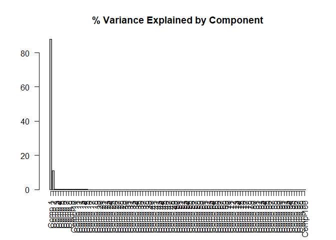
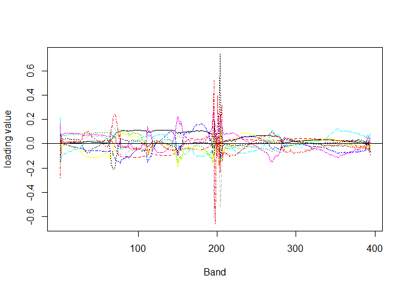

NLCD\_PLS1
================
Cody Flagg
June 19, 2018

### Partial Least Squares (PLS) Analysis of NLCD data from SCBI

-   Only focuses on predicting 3 NLCD classes: "DF", "EF", "SS"
-   Min Band = 383.5343
-   Max Band = 2511.8945
-   5 nm increments
-   Should remove noise in Bands: 191 to 212 and 281 to 314

``` r
## plot raw data
wavelengths<-seq(1, 426,by=1) # wavelengths captured by machine
reflectance <- subdata[,c(11:ncol(subdata))] # reflectance values 

# need to setup the x-axis, the wavelengths, and a transpose of the reflectance matrix with t()
reflectance.plot = matplot(x = wavelengths, y = t(reflectance),lty=1,xlab="wavelengths(nm)",ylab="Reflectance",type="l", main = "Reflectance by Sample")
```


``` r
reflectance_train <- train[,c(11:ncol(train))]
## convert reflectance to a matrix, as this is what plsr() requires
## >> REMOVE WATER VAPOR BAND << ## 
refl_train = as.matrix(reflectance_train[,c(1:281, 314:ncol(reflectance_train))])
train$NLCD <- as.factor(train$NLCD)

## convert NLCD character to factor first, then convert the factor to a numeric value so plsr() can analyze data
NLCD_num <- as.matrix(as.numeric(as.factor(train$NLCD)), ncol=1) # make numeric matrix

## run the model
m1 <- plsr(NLCD_num ~ log(refl_train+1), ncomp = 100, validation = "CV")

## these are the numeric classes converted back to NLCD labels
NLCD_back <-factor(NLCD_num, labels = levels(train$NLCD), levels = 1:3)

## add predictions from the plsr() model
train$pred_num_class <- predict(m1, ncomp = 25) # the output of this is an array, each column in the array is the predicted output for each principal component
#subdata$pred_fac_class <- round(subdata$pred_num_class)

## 1. take the mean prediction from the components (specified by 'ncomp') by applying mean() across a row
## 2. then round that mean, it represents a "vote" for the class value from each component
confusion <- data.frame(actual = NLCD_num, predicted = round(apply(X = train$pred_num_class, 1, FUN = mean)))

# cross reference the actual class versus the predicted class
crossRef <- table(confusion)
```

### Total Components Selected

-   The "full data set" (no split between test and training) root mean squared error "RMSE" plot shows that ~25 principal components returns the lowest amount of error, thus all following graphs and confusion tables use 25 PCs
-   Doing an 80/20 training/testing split returns closer to 10 PCs

``` r
barplot(explvar(m1), axis.lty = 1, las = 2, main = "% Variance Explained by Component")
```



``` r
plot(RMSEP(m1), legendpos = "topright", main = "Validation Error")
```


### Loadings for 10 Components - untransformed Y and X

``` r
loadingplot(m1, comps = 1:10, legendpos = -1, labels = c(1:426), xlab = "Band")
abline(h=0)
```



### Confusion Matrix -- Full Data Set (not split between training and test sets)

-   A fair amount of misclassification with DF
-   Another predictor variable that helps the model differentiate between DF and EF would probably reduce error e.g. do DF and EF occur at different elevations?

``` r
# calculate accuracy for each class
## subset the crossRef table because it has classes predicted as 0 and 4 <for 3 class>
if (ncol(crossRef != length(unique(NLCD_num)))){
    caret::confusionMatrix(crossRef[,c(2:4)])
} else {
    caret::confusionMatrix(crossRef)
}
```

    ## Confusion Matrix and Statistics
    ## 
    ##       predicted
    ## actual   1   2   3
    ##      1 189  37   0
    ##      2   1  26   7
    ##      3   0  34  89
    ## 
    ## Overall Statistics
    ##                                        
    ##                Accuracy : 0.794        
    ##                  95% CI : (0.75, 0.833)
    ##     No Information Rate : 0.496        
    ##     P-Value [Acc > NIR] : <2e-16       
    ##                                        
    ##                   Kappa : 0.659        
    ##  Mcnemar's Test P-Value : NA           
    ## 
    ## Statistics by Class:
    ## 
    ##                      Class: 1 Class: 2 Class: 3
    ## Sensitivity             0.995   0.2680    0.927
    ## Specificity             0.808   0.9720    0.882
    ## Pos Pred Value          0.836   0.7647    0.724
    ## Neg Pred Value          0.994   0.7966    0.973
    ## Prevalence              0.496   0.2533    0.251
    ## Detection Rate          0.493   0.0679    0.232
    ## Detection Prevalence    0.590   0.0888    0.321
    ## Balanced Accuracy       0.902   0.6200    0.904

Validate on Test Data
---------------------

``` r
reflectance_test <- test[,c(11:ncol(test))]
## convert reflectance to a matrix, as this is what plsr() requires
## >> REMOVE WATER VAPOR BAND << ## 
refl_test = as.matrix(reflectance_test[,c(1:281, 314:ncol(reflectance_test))])
test$NLCD <- as.factor(test$NLCD)

## convert NLCD character to factor first, then convert the factor to a numeric value so plsr() can analyze data
NLCD_num_test <- as.matrix(as.numeric(as.factor(test$NLCD)), ncol=1) # make numeric matrix

## add predictions from the plsr() model
testpred <- predict(m1, ncomp = 10, newdata = refl_test) # the output of this is an array, each column in the array is the predicted output for each principal component
#subdata$pred_fac_class <- round(subdata$pred_num_class)

## 1. take the mean prediction from the components (specified by 'ncomp') by applying mean() across a row
## 2. then round that mean, it represents a "vote" for the class value from each component
confusion <- data.frame(actual = NLCD_num_test, predicted = round(testpred))

# cross reference the actual class versus the predicted class
crossRef <- table(confusion)
caret::confusionMatrix(crossRef[,c(2:4)])
```

    ## Confusion Matrix and Statistics
    ## 
    ##       NLCD_num.10.comps
    ## actual  1  2  3
    ##      1 23 26  8
    ##      2  0  1  1
    ##      3  0 12 17
    ## 
    ## Overall Statistics
    ##                                         
    ##                Accuracy : 0.466         
    ##                  95% CI : (0.359, 0.575)
    ##     No Information Rate : 0.443         
    ##     P-Value [Acc > NIR] : 0.372         
    ##                                         
    ##                   Kappa : 0.262         
    ##  Mcnemar's Test P-Value : 2.12e-09      
    ## 
    ## Statistics by Class:
    ## 
    ##                      Class: 1 Class: 2 Class: 3
    ## Sensitivity             1.000   0.0256    0.654
    ## Specificity             0.477   0.9796    0.806
    ## Pos Pred Value          0.404   0.5000    0.586
    ## Neg Pred Value          1.000   0.5581    0.847
    ## Prevalence              0.261   0.4432    0.295
    ## Detection Rate          0.261   0.0114    0.193
    ## Detection Prevalence    0.648   0.0227    0.330
    ## Balanced Accuracy       0.738   0.5026    0.730
